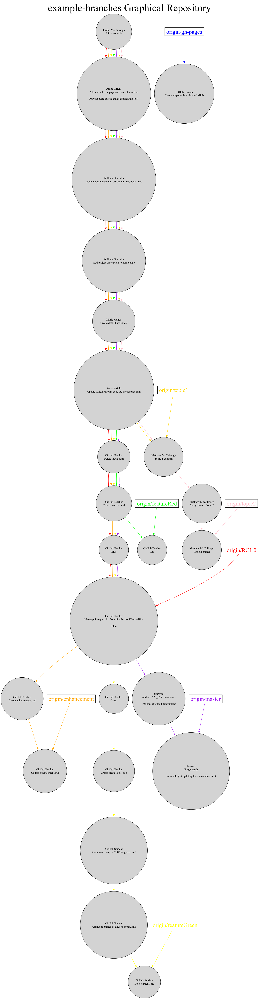

# Repository Visualizer

## Overview

The **Repository Visualizer** application provides a graphical representation of a local Git repository. By analyzing the repository's commits and branches, it generates a visual graph that illustrates the structure and history of the repository.

## Features

- Visualizes the commit history and branches of a Git repository.
- Generates an PNG image of the repository graph.
- Allows easy inspection of repository structure and history.

## Installation
1. **Installing dependencies**
  - To install the needed dependencies to run the visualizer you will have to use the `requirements.txt` file.
  - To install the dependencies run the command:
  ```bash
  pip install -r requirements.txt
  ```

2. **Clone the Repository**
  - Clone the repository you want to visualize using the command:
   ```bash
   git clone <repository-url>
   ```

## Usage

1. **Run the Application**
- Execute the Python script and provide the path to your local Git repository:
```bash
python graph_it.py /path/to/your/repo
```

2. **View the Output**
- The application will generate an PNG file representing the repository graph.

## Code Overview

`graph_it.py`: Main script for generating the repository graph and PNG file.
`requirements.txt`: List all the required dependencies.


Here’s an example of the visual output you can expect:



